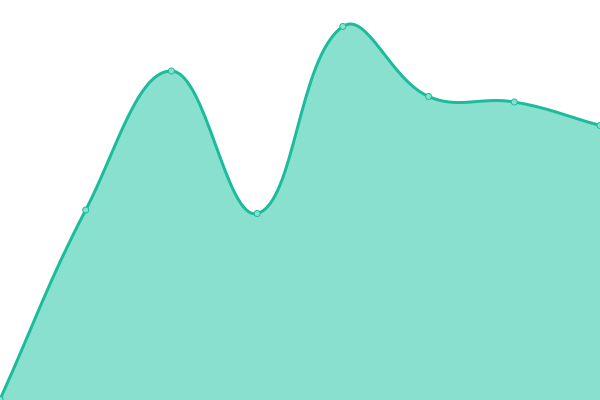

# [📈 Live Status](https://warielon.github.io/upptime): <!--live status--> **🟩 All systems operational**

This repository contains the open-source uptime monitor and status page for [Wariel](https://warielon.github.io/upptime), powered by [Upptime](https://github.com/upptime/upptime).

With [Upptime](https://upptime.js.org), you can get your own unlimited and free uptime monitor and status page, powered entirely by a GitHub repository. We use [Issues](https://github.com/warielon/upptime/issues) as incident reports, [Actions](https://github.com/warielon/upptime/actions) as uptime monitors, and [Pages](https://warielon.github.io/upptime) for the status page.

<!--start: status pages-->
<!-- This summary is generated by Upptime (https://github.com/upptime/upptime) -->
<!-- Do not edit this manually, your changes will be overwritten -->
<!-- prettier-ignore -->
| URL | Status | History | Response Time | Uptime |
| --- | ------ | ------- | ------------- | ------ |
|  [Vichnu-Production](https://vichnu-production.fr) | 🟩 Up | [vichnu-production.yml](https://github.com/warielon/upptime/commits/HEAD/history/vichnu-production.yml) | 

 1425ms
     
 | 

<a href="https://warielon.github.io/upptime/history/vichnu-production">100.00%</a>
    

|  [phoenix-accompagnement](https://phoenix-accompagnement.fr) | 🟩 Up | [phoenix-accompagnement.yml](https://github.com/warielon/upptime/commits/HEAD/history/phoenix-accompagnement.yml) | 

 1707ms
     
 | 

<a href="https://warielon.github.io/upptime/history/phoenix-accompagnement">100.00%</a>
    

|  [au-coeur-des-trois-mondes](https://aucoeurdes3mondes.fr) | 🟩 Up | [au-coeur-des-trois-mondes.yml](https://github.com/warielon/upptime/commits/HEAD/history/au-coeur-des-trois-mondes.yml) | 

 2109ms
     
 | 

<a href="https://warielon.github.io/upptime/history/au-coeur-des-trois-mondes">100.00%</a>
    

|  [thoirzaneries](https://thoirzaneries.fr) | 🟩 Up | [thoirzaneries.yml](https://github.com/warielon/upptime/commits/HEAD/history/thoirzaneries.yml) | 

 1176ms
     
 | 

<a href="https://warielon.github.io/upptime/history/thoirzaneries">100.00%</a>
    

|  [shiftopie.org](https://shiftopie.org) | 🟩 Up | [shiftopie-org.yml](https://github.com/warielon/upptime/commits/HEAD/history/shiftopie-org.yml) | 

 1679ms
     
 | 

<a href="https://warielon.github.io/upptime/history/shiftopie-org">96.26%</a>
    

|  [app.shiftopie.org](https://shiftopie.herokuapp.com) | 🟩 Up | [app-shiftopie-org.yml](https://github.com/warielon/upptime/commits/HEAD/history/app-shiftopie-org.yml) | 

 535ms
     
 | 

<a href="https://warielon.github.io/upptime/history/app-shiftopie-org">100.00%</a>
    

<!--end: status pages-->

[**Visit our status website →**](https://warielon.github.io/upptime)

## 📄 License

- Powered by: [Upptime](https://github.com/upptime/upptime)
- Code: [MIT](./LICENSE) © [Anand Chowdhary](https://anandchowdhary.com), supported by [Pabio](https://pabio.com)
- Data in the `./history` directory: [Open Database License](https://opendatacommons.org/licenses/odbl/1-0/)
